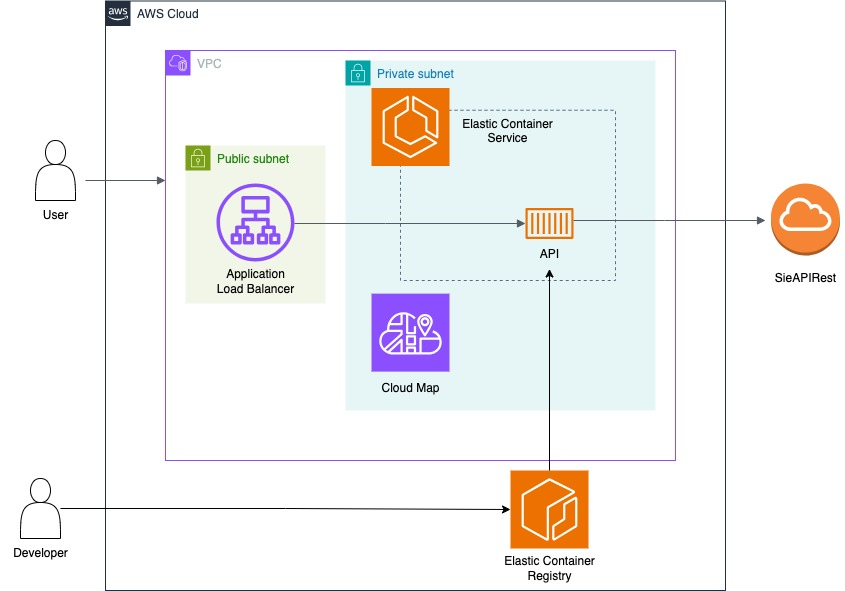
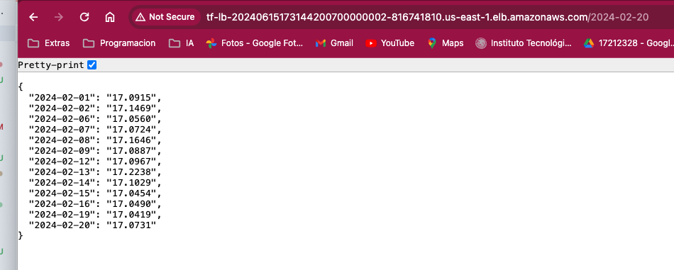

# Microservice Infraestructure with Terraform and AWS
This project builds an infrastructure for the execution of microservices.
The following diagram shows the components used:

## Enviroments
This project allows you to build any number of environments (such as development, staging, production, etc.) through the use of terraform workspaces.
The method of use is as follows:
1. Initialize the terraform component: `terraform init`.
2. Create the environment you want, in this example we create the development environment: `terraform workspace new dev`.
3. Create the corresponding infrastructure resources: `terraform apply`.

## Provisioning of core infrastructure
This repository has the following folders which define the configurations necessary to create the resources of this architecture:
- `infra/vpc`
- `infra/ecs`
- `infra/dns`
- `infra/alb`
### `infra/vpc` directory
Contains the terraform code necessary to generate the necessary VPCs.

### `infra/ecs` directory
Contains the terraform code necessary to build the Amazon Elastic Container Service.

### `infra/dns` directory
Contains the terraform code necessary to build the AWS Cloud Map service, this service performs the function of a DNS in the cluster, which allows communication between different services in the same cluster.

### `infra/alb` directory
Directory containing the terraform code needed to launch the Application Load Balancer service.

## API Release
To deploy the API there are the following directories:
- `api`
- `infra/ecr`
- `infra/api_service`

### `api` directory
Contains the API code developed with FastAPI.

### `infra/ecr` directory
Contains the terraform code necessary to build the ECR repository that will host the API docker image.

### `infra/api_service` directory
Terraform code to generate all the resources necessary to build the microservice in the existing ECS.

## Sample of the final result
Once all the components have been generated, it is only necessary to enter the _load balancer_ and use the _dns name_ as the url of the API.
